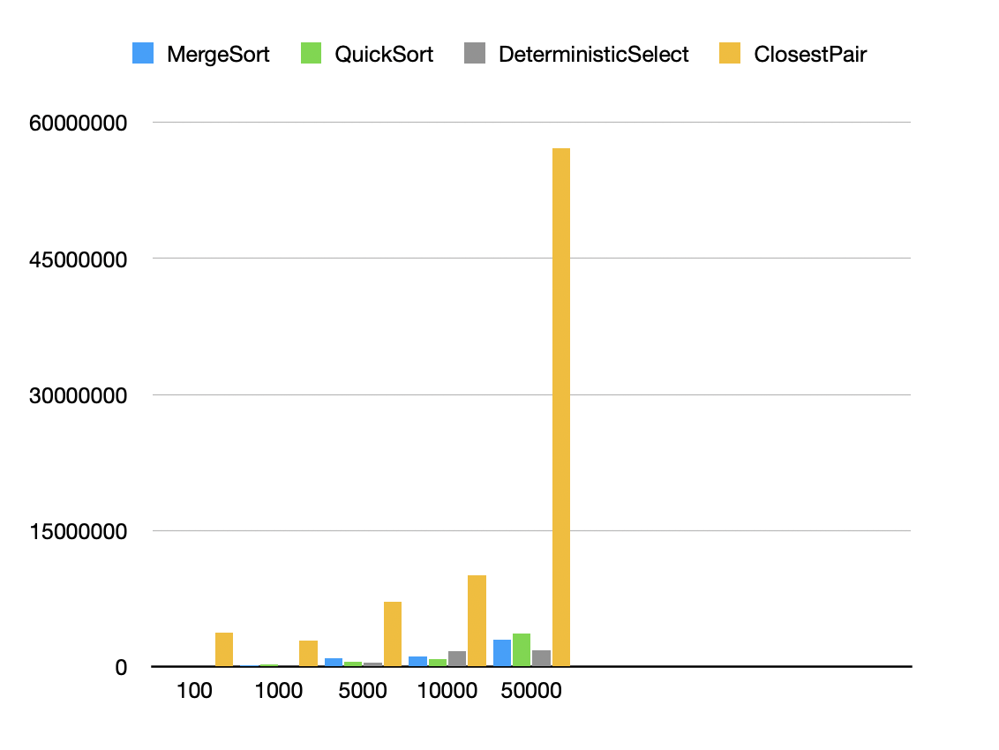
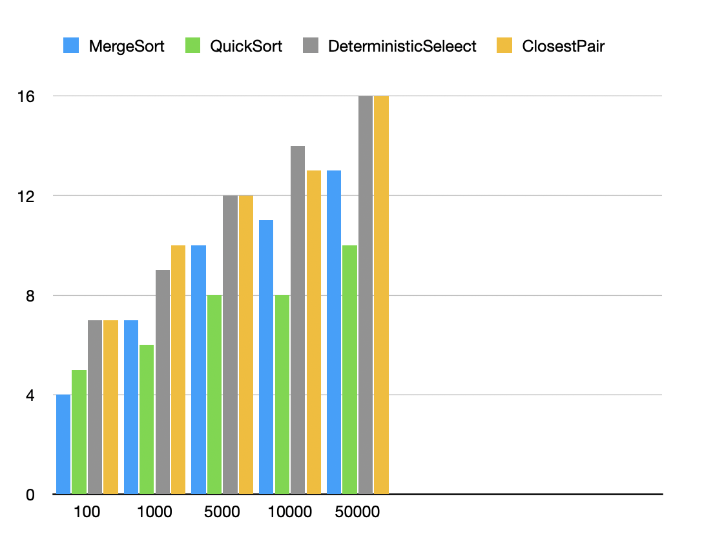
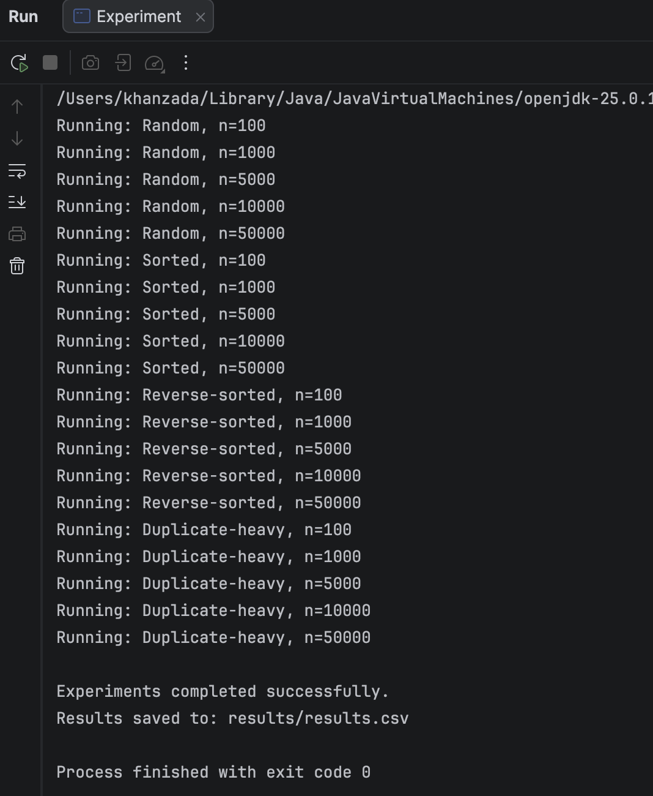
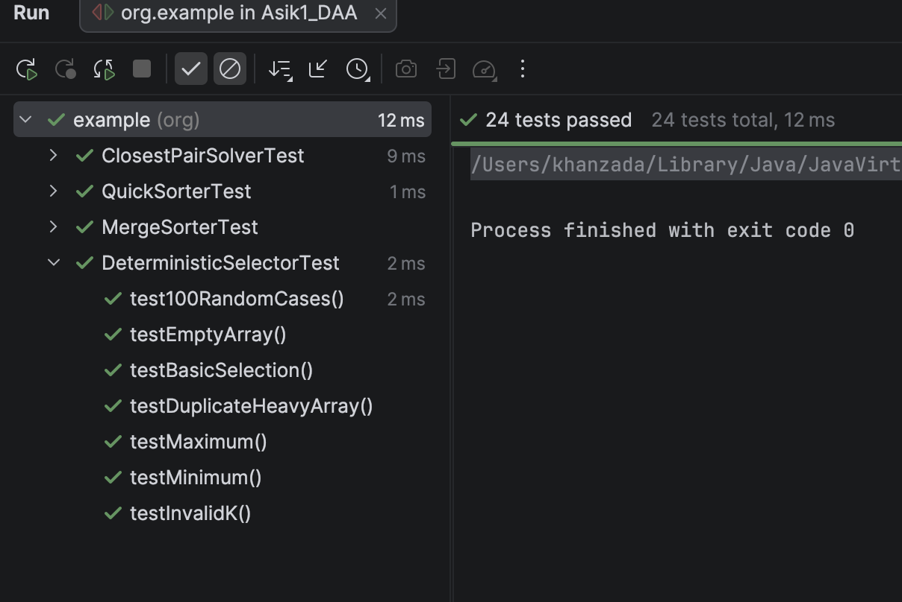

# Assignment 1: Divide-and-Conquer Algorithm Analysis

## A. Project Overview

The purpose of this assignment is to understand divide-and-conquer algorithms and compare their theoretical and practical performance.

In this project, I implemented four divide-and-conquer algorithms:

* MergeSort
* QuickSort
* Deterministic Select
* Closest Pair of Points

I used Java for the implementation and JUnit for testing.

I also made experiments with different input sizes and input types. I measured execution time, recursion depth, comparisons, and swaps.

The input types were:

* Random
* Sorted
* Reverse-sorted
* Duplicate-heavy

The project also includes test results, CSV results, and two plots.

## B. Algorithm Analysis

### 1. MergeSort

MergeSort divides an array into two parts. It sorts both parts and then joins them together.

In my implementation, I used a reusable buffer for merging. I also used insertion sort for small arrays.

Time complexity:

* Best case: O(n log n)
* Average case: O(n log n)
* Worst case: O(n log n)

Space complexity:

* O(n)

The main recurrence is:

```text
T(n) = 2T(n/2) + O(n)
```

Using the Master Theorem:

```text
a = 2
b = 2
f(n) = O(n)
```

This gives:

```text
T(n) = O(n log n)
```

### 2. QuickSort

QuickSort chooses a pivot and divides the array into smaller and larger elements.

In my implementation, the pivot is random. The algorithm works in-place. It also processes the smaller partition first and uses a loop for the larger partition.

Time complexity:

* Best case: O(n log n)
* Average case: O(n log n)
* Worst case: O(n²)

Space complexity:

* O(log n) typical recursion stack

For a balanced partition:

```text
T(n) = 2T(n/2) + O(n)
```

Using the Master Theorem:

```text
T(n) = O(n log n)
```

For a very unbalanced partition:

```text
T(n) = T(n-1) + O(n)
```

This gives the worst case:

```text
T(n) = O(n²)
```

### 3. Deterministic Select

Deterministic Select finds the k-th smallest element in an array.

It uses the Median-of-Medians method.

The algorithm works as follows:

1. Divide the elements into groups of five.
2. Find the median of each group.
3. Find the median of these medians.
4. Use this value as the pivot.
5. Partition the array.
6. Continue only with the part that contains the required element.

Time complexity:

* Best case: O(n)
* Average case: O(n)
* Worst case: O(n)

Space complexity:

* The algorithm uses in-place partitioning and recursion.

The main recurrence is:

```text
T(n) <= T(n/5) + T(7n/10) + O(n)
```

Using the Akra-Bazzi idea, the result is:

```text
T(n) = O(n)
```

Median-of-Medians guarantees a good pivot, so the algorithm cannot repeatedly choose a very bad pivot.

### 4. Closest Pair of Points

Closest Pair finds two points with the smallest distance between them.

The algorithm first sorts the points by x-coordinate. Then it divides the points into two parts.

It finds the closest pair in both parts. After that, it checks the points near the middle line.

Time complexity:

* O(n log n)

Space complexity:

* The implementation uses additional arrays during recursive splitting.

The main recurrence is:

```text
T(n) = 2T(n/2) + O(n)
```

Using the Master Theorem:

```text
T(n) = O(n log n)
```

This algorithm is faster than the simple O(n²) brute-force method for large inputs because it does not compare every pair of points.

## C. Experimental Results

I used `System.nanoTime()` to measure the execution time.

I tested the following input sizes:

* 100
* 1000
* 5000
* 10000
* 50000

I tested four input types:

* Random
* Sorted
* Reverse-sorted
* Duplicate-heavy

For each experiment, I measured:

* Execution time
* Maximum recursion depth
* Number of comparisons
* Number of swaps

The results were saved in:

```text
results/results.csv
```

There are 80 experimental records in the CSV file.

### Execution Time Results

The following table shows the results for random input with n = 50000.

| Algorithm            | Time (ns) | Recursion Depth | Comparisons |  Swaps |
| -------------------- | --------: | --------------: | ----------: | -----: |
| MergeSort            |   3002625 |              13 |      773577 |      - |
| QuickSort            |   3610166 |              10 |      959391 | 508937 |
| Deterministic Select |   1824959 |              16 |      513582 | 182174 |
| Closest Pair         |  57090792 |              16 |     1698466 |      - |

For this test, Deterministic Select had the lowest execution time.

Closest Pair took more time because it works with two-dimensional points and performs more operations.

### Results for Different Input Types

For random input, the algorithms worked normally and the running times increased when the input size increased.

For sorted input, MergeSort was very fast because the data was already ordered. The implementation can skip some unnecessary merge work.

For reverse-sorted input, MergeSort was still stable. QuickSort also worked well because it uses a random pivot.

Duplicate-heavy input gave a different result. QuickSort made many comparisons for n = 50000:

```text
125172263 comparisons
```

Its execution time was about:

```text
57.7 ms
```

Deterministic Select worked better with duplicate values because it uses three-way partitioning.

### Recursion Depth Results

The following table shows the recursion depth for random input.

|     n | MergeSort | QuickSort | Deterministic Select | Closest Pair |
| ----: | --------: | --------: | -------------------: | -----------: |
|   100 |         4 |         5 |                    7 |            7 |
|  1000 |         7 |         6 |                    9 |           10 |
|  5000 |        10 |         8 |                   12 |           12 |
| 10000 |        11 |         8 |                   14 |           13 |
| 50000 |        13 |        10 |                   16 |           16 |

QuickSort has a relatively small recursion depth because it processes the smaller partition recursively and the larger partition with a loop.

### Plots

I created two plots from the experimental results.

#### Time vs. n

This plot shows how the execution time changes when the input size increases.



#### Recursion Depth vs. n

This plot shows how the maximum recursion depth changes when the input size increases.



## D. Discussion

The results are mostly close to the theoretical complexity.

MergeSort has O(n log n) complexity, and its performance was stable for different input types.

QuickSort was also fast in many tests. However, its performance changed more depending on the input structure. Random pivot selection helps QuickSort, but it cannot remove all effects of the input data.

Smaller-first recursion helps QuickSort because the recursive call is always made for the smaller partition. The larger partition is processed using a loop. This keeps the recursion depth smaller and reduces the risk of a very large call stack.

Median-of-Medians gives O(n) worst-case time because it chooses a good pivot. The groups of five help the algorithm remove a fixed part of the elements after each partition. Therefore, the algorithm does not repeatedly choose very bad pivots.

The divide-and-conquer Closest Pair algorithm is faster than O(n²) for large inputs because it does not compare every pair of points. It divides the points into smaller parts and only checks a limited number of points near the middle. Its time complexity is O(n log n).

The practical running time can also depend on other factors. JVM warm-up and JIT compilation can change the running time. CPU cache can make some operations faster. Garbage collection can also affect the results when the program creates many objects or arrays. Memory allocation and other programs running on the computer can also affect the measured time.

Because of these factors, practical results can be different from theoretical results.

## E. Reflection

This project helped me understand divide-and-conquer algorithms better. At first, recursive algorithms were difficult for me to understand. QuickSort, Deterministic Select, and Closest Pair were especially difficult. I learned that it is important to understand the algorithm step by step before writing the Java code.

During the project, I learned how to use recursion, measure execution time, measure recursion depth, and write tests with JUnit. I also learned that the same algorithm can work differently with different types of input. The project helped me improve my Java, testing, recursion, and algorithm analysis skills.

## F. Screenshots

### Program Output



### Test Results



### Results


### Time vs. n


### Recursion Depth vs. n


## Project Structure

```text
assignment1-divide-and-conquer/
│
├── src/
│   ├── main/
│   │   └── java/
│   │       └── org.example/
│   │           ├── MergeSorter.java
│   │           ├── QuickSorter.java
│   │           ├── DeterministicSelector.java
│   │           ├── ClosestPairSolver.java
│   │           ├── Point.java
│   │           ├── Experiment.java
│   │           └── Main.java
│   │
│   └── test/
│       └── java/
│           └── org.example/
│               ├── MergeSorterTest.java
│               ├── QuickSorterTest.java
│               ├── DeterministicSelectorTest.java
│               └── ClosestPairSolverTest.java
│
├── docs/
│   ├── screenshots/
│   └── plots/
│       ├── time_vs_n.png
│       └── recursion_depth_vs_n.png
│
├── results/
│   └── results.csv
│
├── README.md
├── pom.xml
└── .gitignore
```
